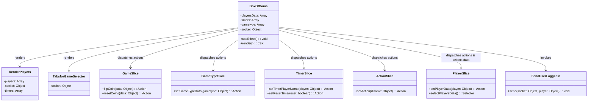
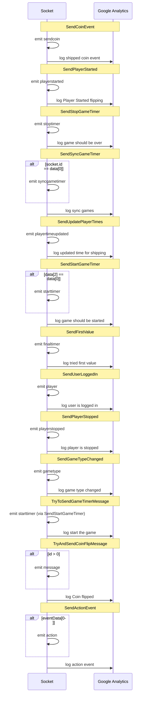
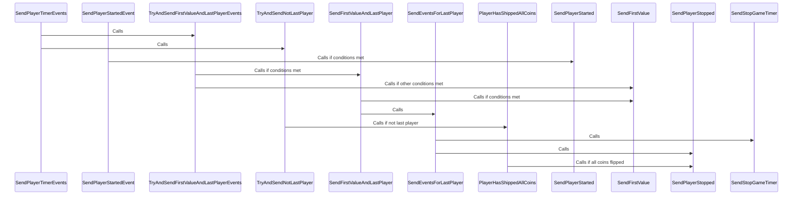
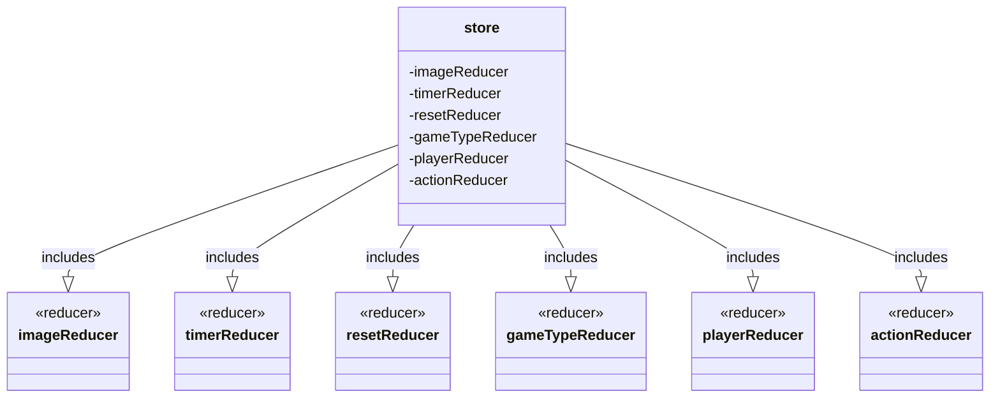

# Coin Flip Agile Exercise

## Architecture

Built using react js.

## Dependencies

1. Node API
   1. Socket IO
   2. GET /api
2. Firebase Application

## Release

1. Node API

   1. Google Cloud
      1. Install and login to goggle cloud cli then run the following command.
      2. gcloud run deploy --project coinflipapi-50514 --allow-unauthenticated --source=.
      3. Service name (coinflipserver): chatserver

2. Coin flip Application
   1. Firebase https://console.firebase.google.com/project/coinflipgame-50514/overview
   2. To Deploy from Terminal: ./Firebasedeploy

## Play

1. Flip the required number of coins over
2. Ship the coins to the next player

## Domain Diagram

## Game Event Diagram

## Timer Event Diagram

## Player state Diagram

